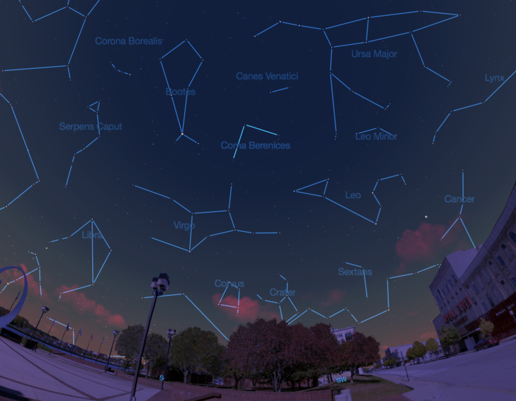

## Coma Berenices

Welcome to our [Method Data Science](http://www.methoddatascience.com/) repository. 

The [Coma Berencies](https://ttpinsights.com/) is a three man team that consists of [Andy Felicitas](https://github.com/ABFdata), [Lorenzo Yniguez](https://github.com/lyniguez) and [Tommy Steed](https://github.com/tommysteed).

Here, you'll find code to our projects and kaggle competitions that we participated in throughout the course.

To learn more about us, visit [TTP Insights](https://ttpinsights.com/).
